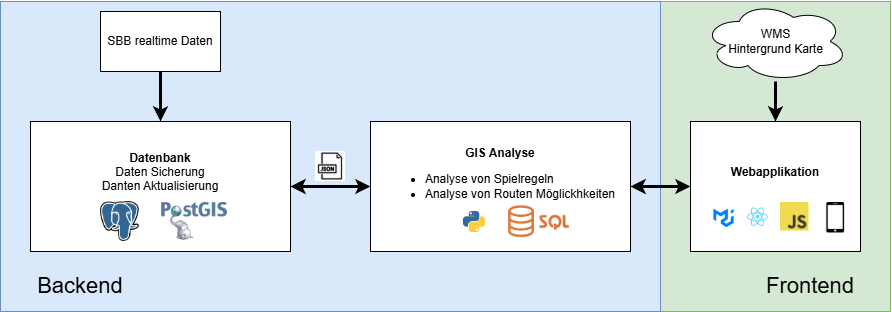

# Aufbau Geodateninfrastruktur (GDI)

Eine vollständige Geodateninfrastruktur (GDI) umfasst das Backend, das Frontend sowie die verwendeten Bibliotheken und API-Schnittstellen. Das folgende Schema zeigt die entwickelte und genutzte GDI der Ticket to Escape Webapplikation.

## Backend

Das Backend beinhaltet alle unsichtbaren Inhalte und Daten, die sich auf dem Server. 
Dazu gehören folgenden Punkte:

- Ein Räumliches Datenbanksystem (RDBS) bestehend aus einer PostgreSQL Datenbank mit PostGIS erweiterung.
- API-Schnittstelle
- Node-Server als Schnittstelle zwischen dem RDBS und dem Frontend

Die Datenbank ist mit dem GTFS Datensatz der SBB abgefüllt. Die GTFS Daten müssen bei Fahrplanwechsel neu erfasst werden! Die Tabellen welche fürs Spiel verwendet werden sind per default leer.

## API

Die API werden für den Datentrasnfer zwischen Front-/ Backend verwendet. Erfasste/ gewählte Daten werden aus dem Frontend als Payload ins Backend geschickt. Hier werden je nach Endpoint die Daten weiterverarbeitet und in die Datenbank gespielt. Das gleiche geschieht mit Abfragen an die DB.

[↑](#top)

  

    <a href="funktionen.html">← Erklärung der Funktionen</a>
  

  

    <a href="ausblick.html">Erweiterungsmöglichkeiten →</a>
  

