# Funktionen der App Ticket to Escape

Anbei werden die Funktionalitäten der einzelnen Komponenten der App erklärt. 

## Spiel erstellen
Der erste Spieler erstellt mit dem Button ***Neues Spiel*** ein Spiel und definiert die *Maximale Spieldauer (Stunden)* und die *Anzahl Polizisten*. Die maximale Spieldauer wurde auf 10 Stunden begrenzt und mindestens eine Polizistengruppe muss dem Spiel beitreten. 

  
  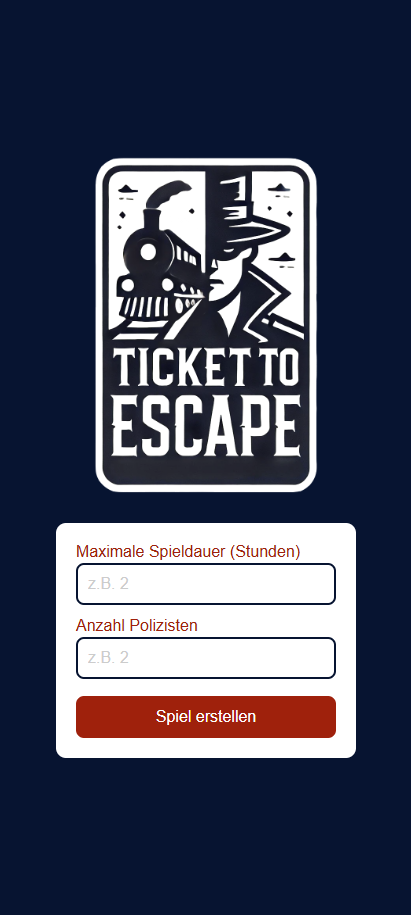

Anschliessend kann die eigene Rolle im Spiel gewählt werden und der Spielname angegeben. Im Warteraum erscheint die **Spiel-ID** welche den anderen Gruppen mitgeteilt werden muss. Sind alle Gruppen im Warteraum eingeloggt, kann das Spiel gestartet werden. 

  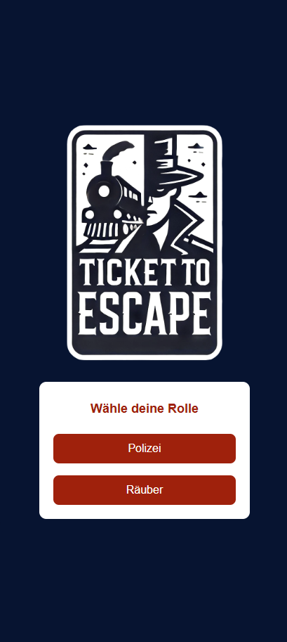
  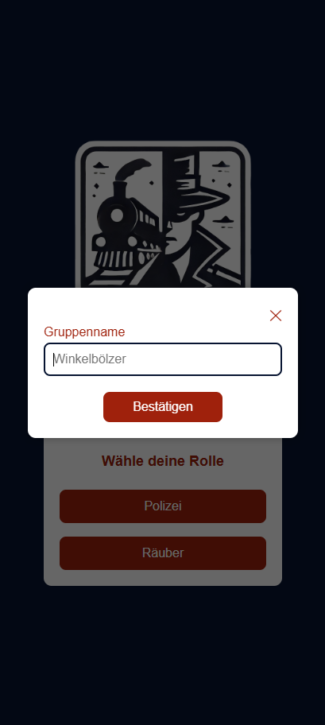
    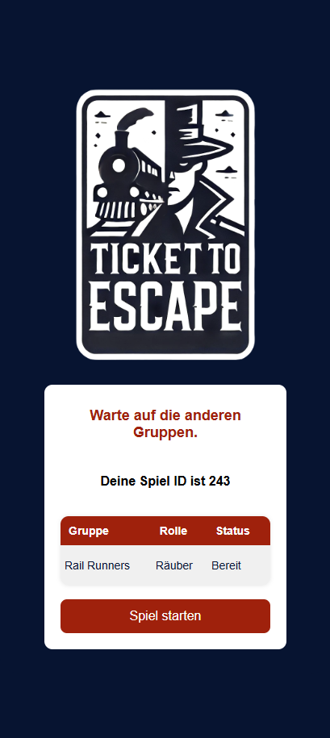

## Spiel beitreten
Wurde das Spiel bereits erstellt, kann man mit der
**Spiel-ID** einem Spiel beitreten, die eigene Rolle und den Name angeben. Anschliessend tritt man zum Warteraum hinzu und kann das Spiel starten sobald die Räuber und eine Polizistengruppe bereit ist.

  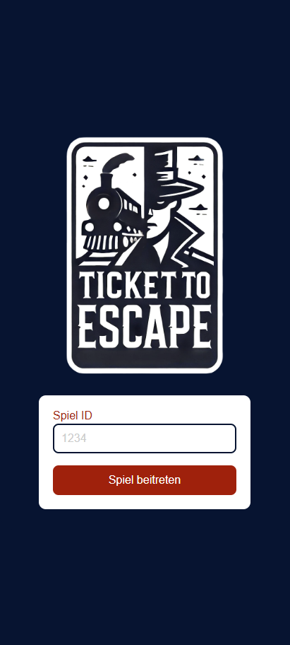
  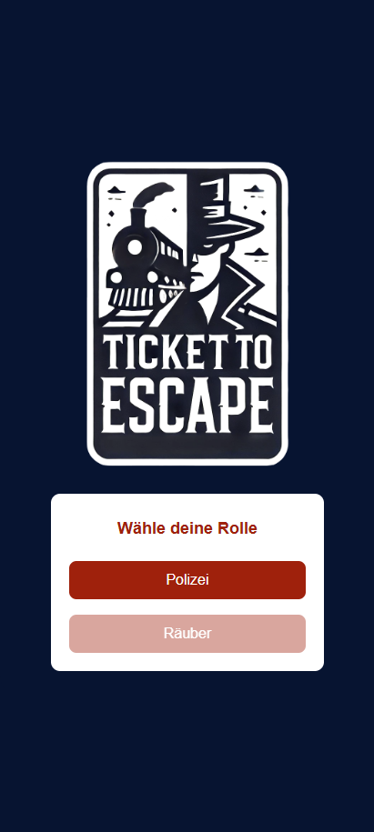
    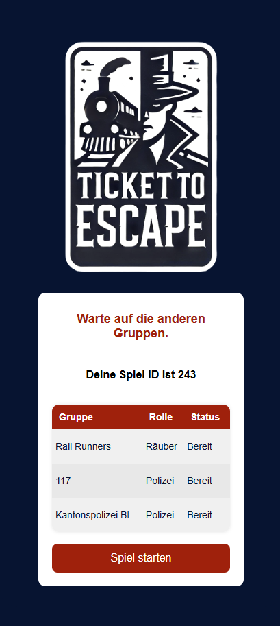

## Bahnhof und Verbindungen suchen
Von einem Bahnhof aus lassen sich die nächsten Verbindungen samt Abfahrtszeit, Linie, Richtung und Gleis anzeigen. mittels  dem Button ***Nächste Verbindung*** werden spätere Verbindungen geladen. Wählt man eine dieser Verbindungen aus, erscheinen die Haltestellen der Verbindung. 

  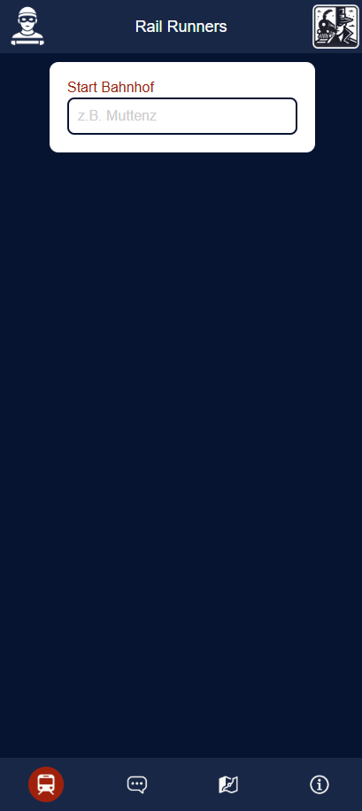
  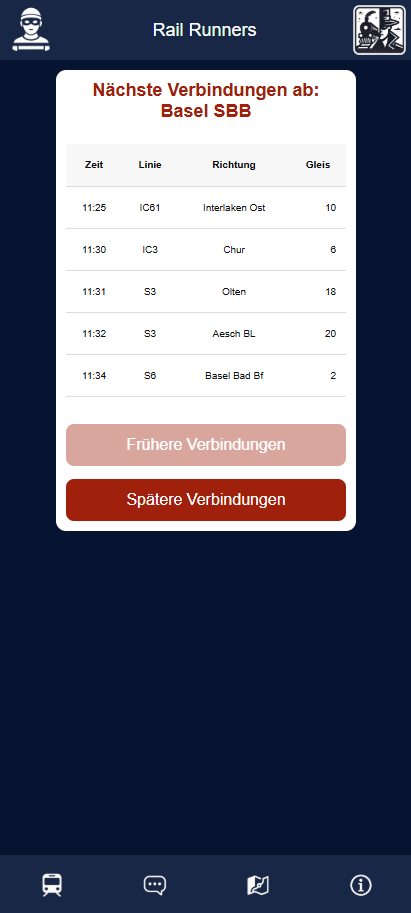
    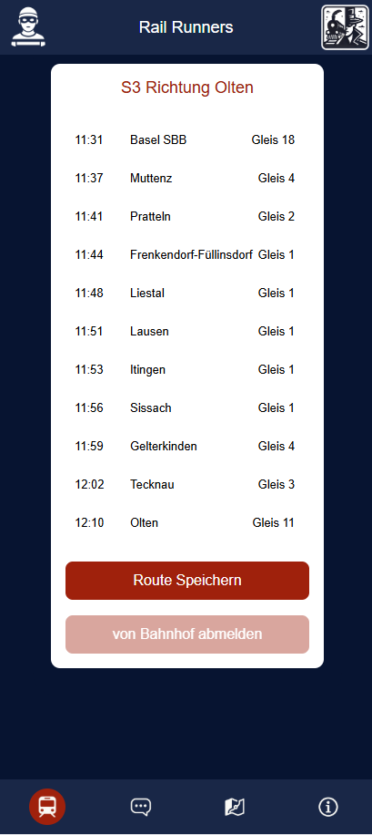

## Informationen teilen Polizisten
Die Polizisten können grösstenteils entscheiden wie viele Informationen sie mit dem anderen Gruppen teilen. Dabei kann entscheiden werden ob sie den Bahnhof mit den anderen Gruppen teilen. Beim Auswählen des Bahnhof erscheint ein Pop-up mit der Meldung ***Bahnhof im Chat speichern?***

  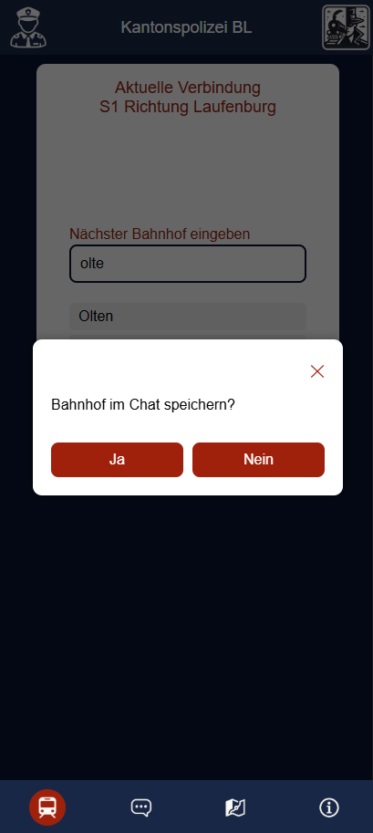

Jede zweite Route muss den anderen Gruppen gemeldet werden. Somit kann im Pop-up ***Trip im Chat speichern?*** ausgewählt werden ob die Verbindung im [Chat](##Chat) gesendet werden soll.

  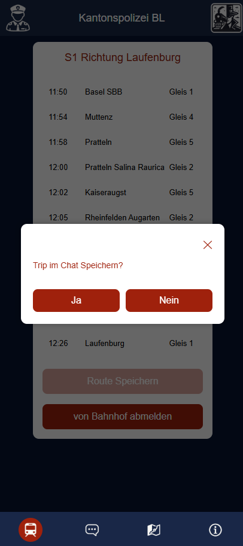

## Informationen teilen Räuber
Die Räuber müssen sich immer melden, wenn sie einen Bahnhof verlassen. Dabei wird jeweils wenn man eine Verbindung ausgewählt hat mit dem Button ***Route Speichern*** die Route erfasst. Aus taktischen Gründen können sie sich dafür entscheiden länger angemeldet zu bleiben. Ist dies der Fall, meldsen sie die Route und spätestens nach 15 Minuten können sie mit dem Button ***von Bahnhof abmelden*** den Räubern eine Nachricht im [Chat](##Chat) schicken. 

  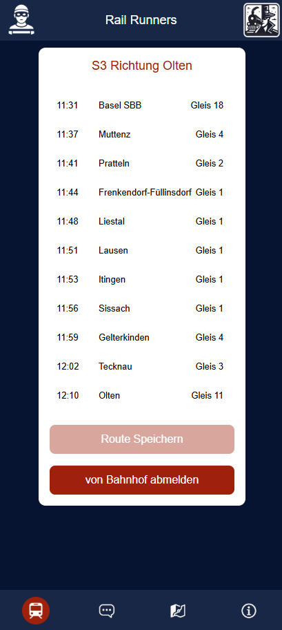

Nachdem die Verbindung erfasst wurde und die Räubergruppe sich am Bahnhof abgemeldet hat, erhält man ein Überblick der ausgewählten Strecke. Während der Fahrt können neue Verbindungen gesucht werden. Bestätigt man die neue Route erhalten die Polizisten automatisch eine Nachricht, dass die Räuber am Bahnhof aussteigen. Die Ausstiegszeit wird aus dem Fahrplannetz abgegriffen und Verspätungen werden dabei nicht abgefangen

  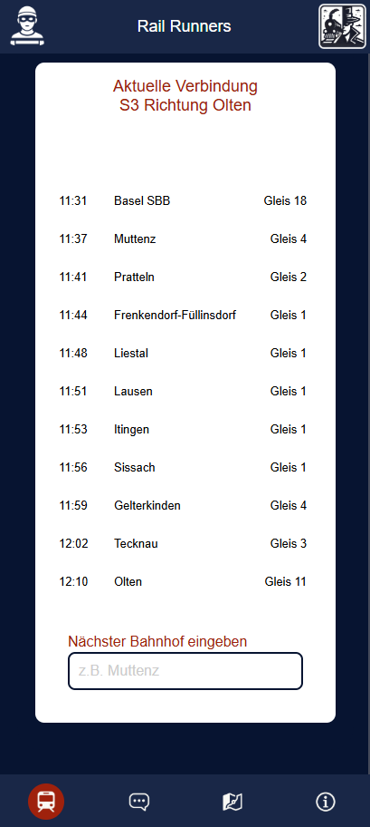

## Chat
Im Chat erscheinen alle geteilten Informationen der anderen Gruppen chronologisch. Zudem sind die Informationen der Gruppen farblich unterteilt.

  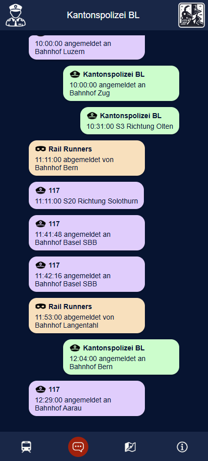

## Karte
Auf der Karte sind alle bereits besuchten Bahnhöfe ersichtlich. Dabei ist beim anwählen des roten Kreises der Bahnhofsname ersichtlich.

  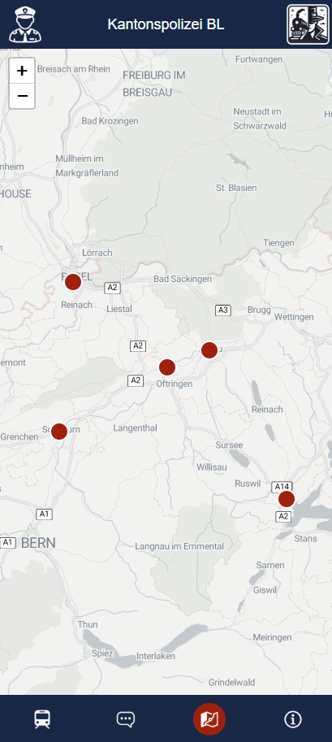

## Informationen
Unter dem Informationsbutton sind die Spielregeln, welche bereits beim erstellen des Spiels aufzufinden waren und das Impressum ersichtlich. 

  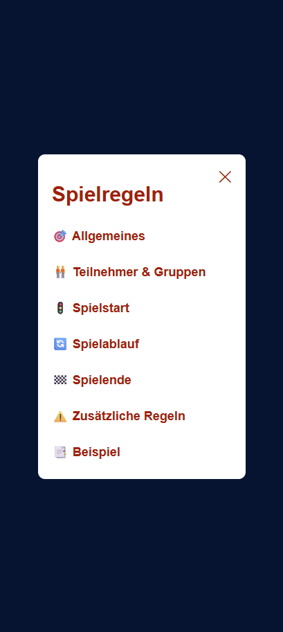

[↑](#top)

  

    <a href="index.html">← Ticket to Escape</a>
  

  

    <a href="aufbauGDI.html">Aufbau GDI →</a>
  

