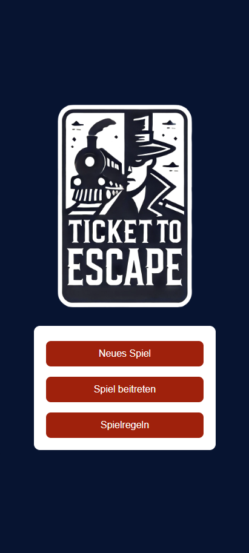

# Funktionen der App Ticket to Escape

Anbei werden die Funktionalitäten der einzelnen Komponenten der App erklärt. 

## Spiel erstellen 
Der erste Spieler erstellt mit dem Button ***Neues Spiel*** ein Spiel und definiert die *Maximale Spieldauer (Stunden)* und die *Anzahl Polizisten*. Die maximale Spieldauer wurde auf 10 Stunden begrenzt und mindestens eine Polizistengruppe muss dem Spiel beitreten. 

  
  

Anschliessend kann die eigene Rolle im Spiel gewählt werden und der Spielname angegeben. Im Warteraum erscheint die **[Spiel-ID](#spiel-id)** welche den anderen Gruppen mitgeteilt werden muss. Sind alle Gruppen im Warteraum eingeloggt, kann das Spiel gestartet werden. 

  
  
 

  
  
    

## Spiel beitreten 
Wurde das Spiel bereits erstellt, kann man mit der 
**Spiel-ID** einem Spiel beitreten, die eigene Rolle und den Name angeben. Anschliessend tritt man zum Warteraum hinzu und kann das Spiel starten sobald die Räuber und eine Polizistengruppe bereit ist. 

## Bahnhof und Verbindungen suchen 
Von einem Bahnhof aus aus lassen sich die nächsten Verbindungen samt Abfahrtszeit, Linie, Richtung und Gleis anzeigen. mittels  dem Button ***Nächste Verbindung*** werden spätere Verbindungen geladen. Wählt man eine dieser Verbindungen aus, erscheinen die Haltestellen der Verbingung. 

## Informationen teilen Polizisten 

## Informationen teilen Räuber

## Chat

## Karte

## Regeln 

[↑](#top)

  

    <a href="einleitung.html">← Einleitung</a>
  

  

    <a href="aufbauGDI.html">Aufbau GDI →</a>
  

